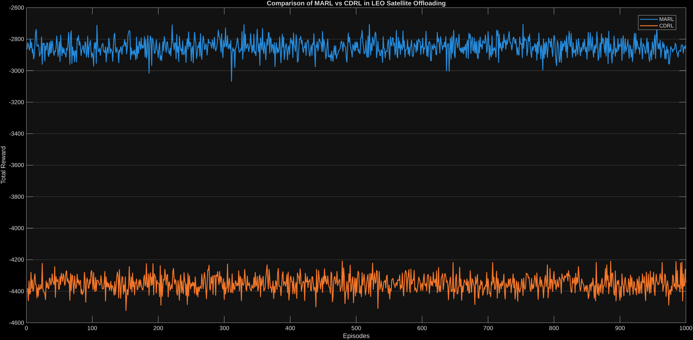
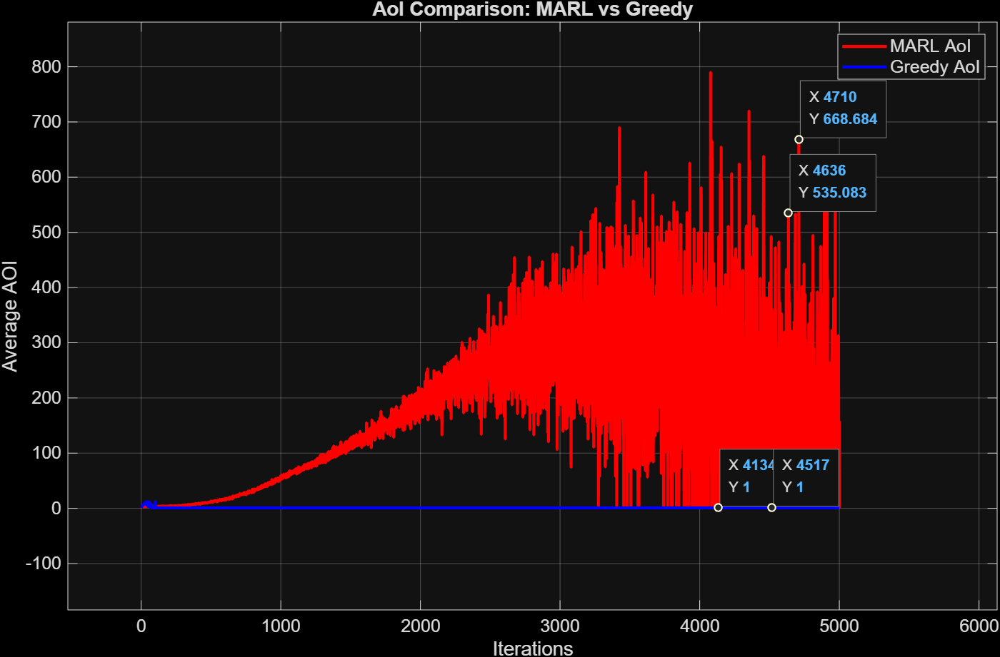
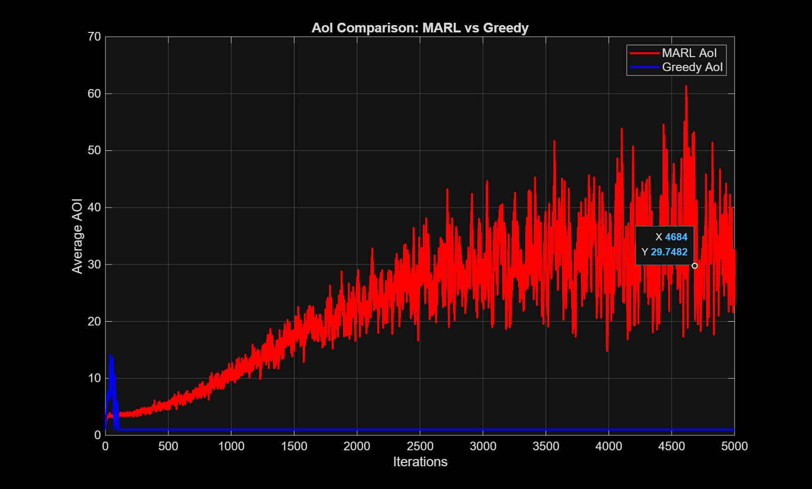

# Information about the code in this repo

* I have only updated the code for MARL_for_RA and Offloading as of now, the results for which I have attached below as well. 

## MARL vs CDRL for the offloading problem 

### The reward function used was -aoi

## MARL vs Greedy for the Resource Allocation problem 

### The reward function used was (aoi_packet_served - next_highest_aoi_in_queue)

## MARL vs Greedy for the Resource Allocation problem 

### The reward function used was (packet_aoi - aoi_after + 0.3 * demand)

